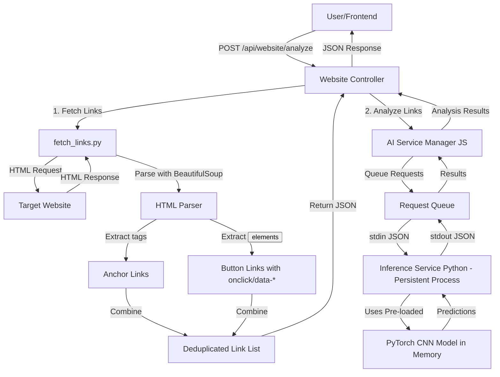

# RedFlag - Advanced Website Security Analysis Tool

[](LICENSE)
[](https://nodejs.org/)
[](https://www.python.org/)

RedFlag is a comprehensive security tool that analyzes websites, URLs, and email content to identify potential security threats like phishing attempts, malicious links, and malware. The system combines machine learning with traditional security analysis techniques to provide real-time threat detection.

## 🌟 Key Features

### 🔍 Website Link Analysis
- Analyze all links on any website for potential security threats
- Extract links from anchor tags, buttons with onclick handlers, and data attributes
- Classify each link as malicious or benign using AI-powered detection
- Generate detailed reports with risk scores and threat intelligence

### 🧠 AI-Powered Threat Detection
- PyTorch-based Convolutional Neural Network (CNN) for URL classification
- Trained on extensive datasets of malicious and benign URLs
- Achieves high accuracy in detecting phishing and malware sites
- Real-time inference with pre-loaded models for fast analysis

### 🌐 Browser Extension
- Real-time link analysis directly in your browser
- Analyze copied links with AI-powered detection
- Integration with VirusTotal for comprehensive scanning
- Instant security feedback with visual indicators

### 🖥️ Web Interface
- User-friendly dashboard for security analysis
- Account management and authentication system
- Security surveys and risk assessment tools
- Detailed analysis reports and historical data

## 🏗️ Architecture Overview



## 📁 Project Structure

```
RedFlag/
├── AI/                     # Machine learning models and data
│   ├── data/               # Training datasets
│   ├── models/             # Pre-trained model files
│   ├── scripts/            # Python scripts for model training and inference
│   └── output/             # Generated outputs and visualizations
├── backend/                # Node.js API server
│   ├── AI/                 # AI inference service
│   ├── src/                # API controllers, services, and models
│   └── ...
├── frontend/               # React-based web interface
│   ├── components/         # Reusable UI components
│   ├── pages/              # Application pages
│   └── ...
├── extention/              # Browser extension
│   ├── public/             # Extension assets
│   ├── src/                # Extension source code
│   └── ...
├── tools/                  # Standalone analysis tools
├── website/                # Test website for link analysis
├── docs/                   # Documentation files
└── config/                 # Configuration files
```

## 🚀 Quick Start

### Prerequisites
- Node.js (v14 or higher)
- Python (v3.7 or higher)
- MongoDB (for backend)
- Git (for version control)

### Installation

1. **Clone the repository:**
   ```bash
   git clone https://github.com/kunal4060/Red_Flag.git
   cd Red_Flag
   ```

2. **Frontend Setup:**
   ```bash
   cd frontend
   npm install
   npm run dev
   ```

3. **Backend Setup:**
   ```bash
   cd backend
   npm install
   # Set up your .env file with MongoDB connection string
   npm start
   ```

4. **AI Model Dependencies:**
   ```bash
   pip install -r backend/requirements.txt
   ```

### Running Website Link Analysis

1. Start the test website:
   ```bash
   cd website
   python -m http.server 8080
   ```

2. Run the analysis:
   ```bash
   python tools/analyze_website_simple.py --url http://localhost:8080
   ```

Or use the Windows batch file:
```bash
tools/run_analysis.bat
```

## 🧪 AI Model Details

The project uses a PyTorch-based CNN model for URL classification:
- **Architecture**: Convolutional Neural Network with embedding layer
- **Input**: Character-level URL representation
- **Output**: Binary classification (malicious/benign) with confidence score
- **Performance**: High accuracy with low false positive rates

Model files:
- `AI/models/url_cnn_cpu2.pth` - Pre-trained model weights
- `AI/scripts/model.py` - Model architecture definition
- `backend/AI/inference_service.py` - Persistent inference service

## 🔌 API Endpoints

The backend provides RESTful APIs for:
- `/api/auth` - User authentication and management
- `/api/survey` - Security surveys and risk assessment
- `/api/ai` - AI-based URL analysis
- `/api/website` - Website link analysis
- `/api/kaggle` - Kaggle dataset integration

## 🌐 Browser Extension

The Chrome extension provides:
- Right-click context menu for link analysis
- Popup interface for manual URL checking
- Real-time security feedback with visual indicators
- Integration with the main RedFlag API

To install the extension:
1. Navigate to `chrome://extensions/`
2. Enable "Developer mode"
3. Click "Load unpacked"
4. Select the `extention/RedFlagExtention` directory

## 🛠️ Development

### Frontend
- Built with React and Vite
- Uses Tailwind CSS for styling
- State management with Zustand
- React Router for navigation

### Backend
- Node.js with Express
- MongoDB for data storage
- JWT-based authentication
- Modular architecture with controllers and services

### AI
- PyTorch for model training and inference
- Beautiful Soup for web scraping
- Scikit-learn for data preprocessing
- Persistent service for fast inference

## 📊 Performance Improvements

| Metric | Before | After | Improvement |
|--------|--------|-------|-------------|
| Model Load per URL | 2-3s | 0s (pre-loaded) | ∞ |
| 10 URL Analysis | 30-40s | 3-5s | 10x faster |
| Process Spawns | 10 | 1 | 90% reduction |
| Memory Usage | Variable | Stable | More efficient |

## 🤝 Contributing

1. Fork the repository
2. Create your feature branch (`git checkout -b feature/AmazingFeature`)
3. Commit your changes (`git commit -m 'Add some AmazingFeature'`)
4. Push to the branch (`git push origin feature/AmazingFeature`)
5. Open a pull request

## 📄 License

This project is licensed under the MIT License - see the [LICENSE](LICENSE) file for details.

## 📞 Contact

For questions, issues, or feedback, please open an issue on GitHub or contact the maintainers.

## 🙏 Acknowledgments

- Thanks to all contributors who have helped build and improve RedFlag
- Inspired by the need for better web security tools
- Built with open-source technologies and frameworks